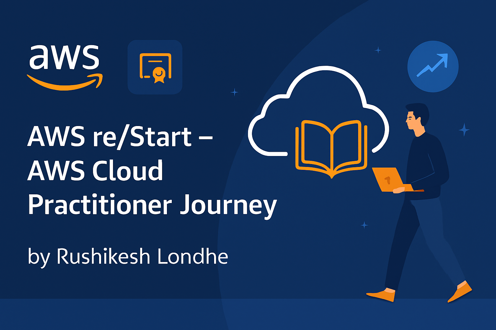

# ☁️ AWS re/Start – AWS Cloud Practitioner Learning Journey  

---

## 📌 About This Repository  

This repository documents my **AWS re/Start** learning journey, aimed at preparing for the **AWS Certified Cloud Practitioner** exam.  
I am currently enrolled in the AWS re/Start program with **Hope Foundation**, gaining hands-on experience in AWS cloud concepts, services, and best practices.  

I will be uploading **structured notes, labs, and topic-wise study materials** as I progress. This serves as both my personal learning record and a resource for others starting their AWS journey.  

---

## 📂 Repository 

Description |

 AWS basics, benefits of cloud computing, shared responsibility model |
 EC2, S3, RDS, VPC, Lambda, and essential AWS services |
 IAM, security best practices, AWS compliance programs |
 Pricing models, cost calculators, AWS Free Tier |
 Topic-wise and exam-style practice questions |
 Step-by-step AWS hands-on labs completed during training |

---

## 🎯 Learning Goals  

- Build a **solid AWS foundation** for cloud computing.  
- Prepare and pass the **AWS Certified Cloud Practitioner** exam.  
- Share AWS learning materials publicly for beginners.  

---

## 🛠 Skills Covered  

- AWS Global Infrastructure  
- Identity and Access Management (IAM)  
- Amazon EC2, S3, RDS, VPC, Lambda  
- Security and Compliance in AWS  
- AWS Pricing Models & Billing Tools  
- Hands-on Lab Exercises  

---

## 🔗 Connect with Me  

  
  

---

## 📜 License  

This repository is licensed under the [MIT License](LICENSE).
